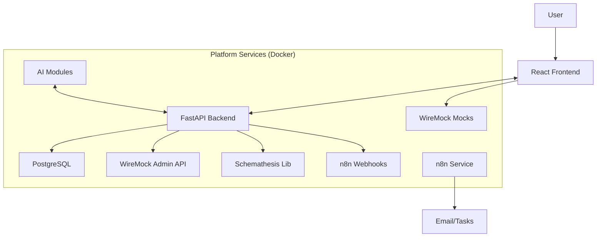
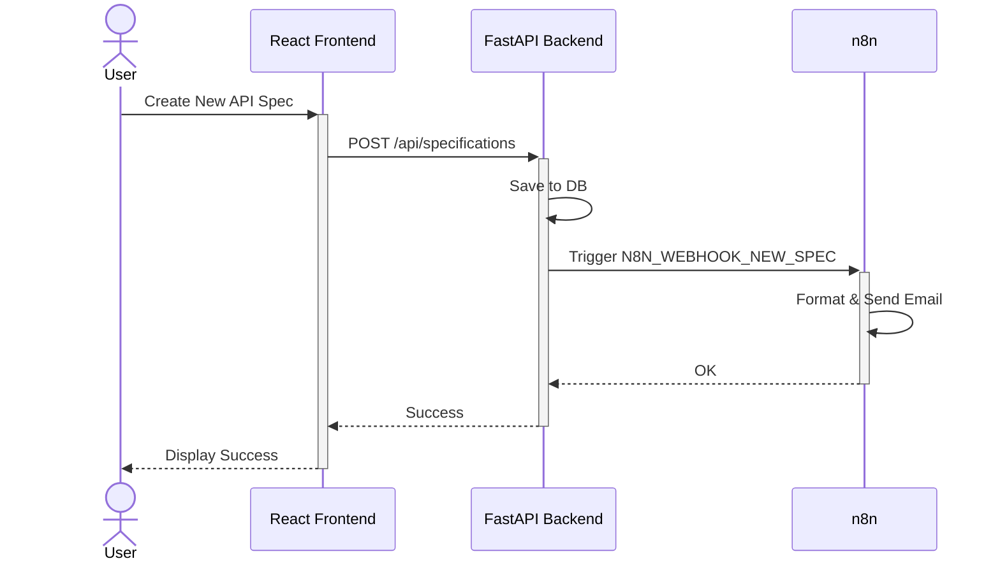
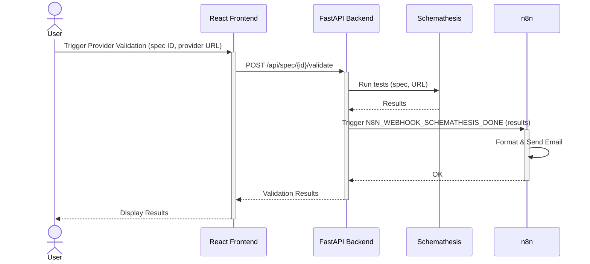
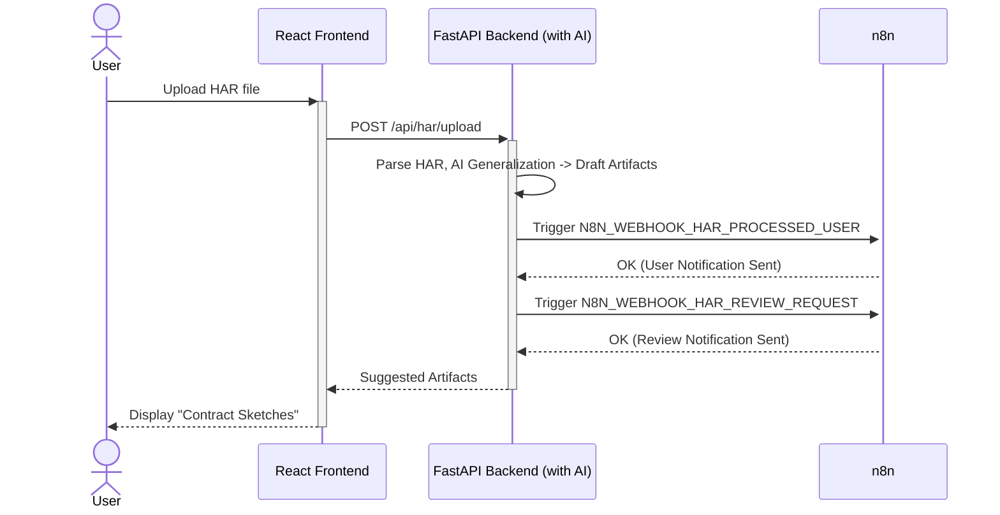

## SpecRepo: Revolutionizing the API Lifecycle

A Unified, AI-Augmented Platform for Specification Management & Mock-Centric Contract Testing

---

## The Challenge: The Modern API Lifecycle is Fragmented

- Developing, testing, and managing APIs is complex
- Siloed tools for design, mocking, testing, and documentation
- Difficulty in keeping specifications, mocks, and tests synchronized
- High barrier to entry for effective contract testing
- Slow feedback loops between API producers and consumers
- Manual effort in generating realistic test data and initial contract sketches

Slower development cycles, integration issues, brittle tests, and increased maintenance overhead.

---

## Our Vision: A Single Source of Truth, Intelligently Managed

We envision a platform that:

- Provides a **unified environment** for the entire API lifecycle.
- **Simplifies contract testing** through an intuitive, mock-centric approach.
- Leverages **Artificial Intelligence** to augment developer productivity and insight.
- Ensures **API specifications are the living contract**, consistently validated and utilized.
- **Accelerates development** by bridging the gap between producers and consumers.

Goal: Empower teams to build reliable, high-quality APIs faster.

---

## Introducing SpecRepo: The Solution

SpecRepo is an API lifecycle management platform that integrates:

- **API Specification Management:** Design, version, and document (OpenAPI, etc.).
- **Advanced Mocking:** Powered by **WireMock** for realistic mock services.
- **Provider Validation:** Using **Schemathesis** for schema compliance.
- **HAR Import & "Contract Sketching":** Bootstrap specs, mocks, and tests from real interactions.
- **AI-Powered Assistance:** For spec generation, test data, analysis, and HAR processing.
- **Workflow Automation:** With **n8n** for notifications and process orchestration.

---

## Architecture

---

## Core Capabilities - 1/2

1. **API Specification Management:**
    - Support for industry standards (OpenAPI, Swagger, GraphQL planned).
    - Intuitive editor, version control, and lifecycle tracking.
    - Automated, interactive documentation generation.
2. **Advanced Mocking Engine (WireMock):**
    - Generate high-fidelity mock endpoints directly from API specifications.
    - Sophisticated request matching, response templating, fault injection.
    - Manageable, AI-suggested test data for mocks.
3. **Robust Provider Validation (Schemathesis):**
    - Producers validate their live services against the API specification.
    - Ensures the actual implementation adheres to the defined contract.

---

## Core Capabilities - 2/2

1. **HAR Import & "Contract Sketching":**
    - Upload HAR files to capture real API interactions.
    - AI analyzes HAR to:
        - Draft API specification snippets.
        - Generate initial WireMock stub configurations.
        - Suggest generalizations and flag sensitive data.
    - Accelerates onboarding of existing APIs and test creation.
2. **AI-Powered Assistance Throughout:**
    - Natural Language to Spec (Future), HAR to Spec.
    - Intelligent test data generation.
    - AI-enhanced documentation and contract analysis.
3. **Workflow Automation & Notifications (n8n):**
    - Automated notifications for key events
    - Orchestrate review processes and other workflows

---

## Innovation: Mock-Centric Contract Testing Simplified

**The Old Way:** Complex setups, separate tools, often theoretical.

**The SpecRepo Way:**

1. **Producer** defines/uploads API Spec (AI-assisted, HAR-informed).
2. **Platform** generates WireMock mocks from the Spec.
3. **Consumer** writes tests against these reliable WireMock mocks.
4. **Producer** validates their *actual service* against the *same API Spec* using **Schemathesis**.
5. If Schemathesis passes, Producer's service aligns with the Spec

Reduced friction, faster feedback, and higher confidence in API integrations.

---

## Tech Stack Powering SpecRepo

- **Frontend:** React, TypeScript, Zustand, Tailwind CSS
- **Backend:** Python, FastAPI
- **Database:** PostgreSQL
- **Mocking:** WireMock
- **Validation:** Schemathesis
- **Workflow Automation:** n8n
- **AI:** Python libraries integrated into FastAPI.
- **Infrastructure:** Docker, Docker Compose

---

## Our MVP: Laying a Solid Foundation

Goal: Deliver core functionalities demonstrating the platform's value.

**MVP Scope - Key Features:**

- API Specification Management: CRUD for OpenAPI specs.
- WireMock Integration: Deploy specs as mocks.
- Schemathesis Integration: Validate provider services against specs.
- Basic HAR Import: Upload HAR, backend processing to draft artifacts
- n8n Notifications
- Basic UI
- Core Backend & Dockerized Environment.

---

## MVP Phased Implementation Overview

1. **Phase 0: Foundation & Setup 🏗️**
2. **Phase 1: Core Backend - API Specs & Data 💾**
3. **Phase 2: Core Contract Testing Mechanics - Backend ⚙️**
4. **Phase 3: Basic Frontend - UI for Core Features 🖥️**
5. **Phase 4: Enhancing Input & Intelligence - HAR & Basic AI 🧠**
6. **Phase 5: Workflow Orchestration & End-to-End MVP 🔄**
7. **Phase 6: Packaging, Documentation & Polish 🎁**

---

## MVP Use Case Example 1: New API Specification & Notification

User creates a spec via UI. Backend saves it and triggers an n8n workflow. n8n sends an email notification.

---

## MVP Use Case Example 2: Validating a Provider & Notification

User triggers validation of a provider's live service. Backend uses Schemathesis, then triggers n8n. n8n notifies on completion.

---

## MVP Use Case Example 3: HAR "Contract Sketching" & Notifications

User uploads a HAR file. Backend processes it using basic AI, generating draft artifacts. n8n sends notifications to the user and for review. Frontend displays "sketches."

---

## Why SpecRepo? The Benefits

- Increased Productivity
- Improved API Quality
- Faster Time-to-Market
- Reduced Integration Risks
- Enhanced Collaboration
- Lower Barrier to Entry

---

## The Future: Beyond MVP

- Advanced AI capabilities
- Broader specification support
- Full BDD integration for test definition.
- Enhanced collaboration features & user management.
- CI/CD integration for automated contract validation.
- SaaS and Self-Hosted offerings.

---

## Call to Action / Q&A

Join us in building the future of API development.

We are seeking Partners / Beta Testers / Investors / Feedback.

Questions?
