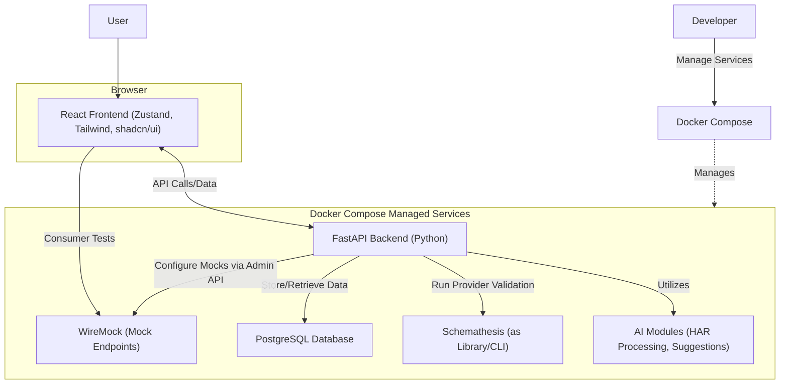

# MVP Tech Stack and Components

* **Frontend Framework:** **React**
* **State Management:** **Zustand**
* **Styling:** **Tailwind CSS**
* **UI Components:** **shadcn/ui** (which utilizes Tailwind CSS)
* **Backend Language/Framework:** **Python** with **FastAPI**
* **Database:** **PostgreSQL**
* **Mocking Engine:** **WireMock** (run as a separate Docker container)
* **Provider Validation Tool:** **Schemathesis** (integrated as a Python library within FastAPI or CLI)
* **HAR Import & Transformation:** Custom Python logic within the FastAPI backend.
* **Basic AI Assistance:** Python libraries (e.g., NLTK, spaCy, scikit-learn, Hugging Face Transformers for smaller local models, or SDKs for LLM APIs if used) integrated into the FastAPI backend.
* **Containerization:** **Docker**
* **Orchestration (MVP):** **Docker Compose**

And here is the Mermaid diagram visualizing these components again:

**Explanation of the Diagram:**

* **User:** Interacts with the **React Frontend**.
* **React Frontend:** Built with React, using Zustand for state management, Tailwind CSS for styling, and shadcn/ui for components. It makes API calls to the backend and, for consumer testing, directly interacts with WireMock's mock endpoints.
* **FastAPI Backend (Python):** The core of the application. It handles:
  * Business logic.
  * Interactions with the **PostgreSQL Database** for data persistence (API specs, user data, test configurations, etc.).
  * Managing **WireMock** by configuring mock services via WireMock's Admin API.
  * Utilizing **Schemathesis** (either as an imported library or by invoking its CLI) for provider-side specification compliance testing.
  * Integrating **AI Modules** for features like HAR file processing, test data suggestions, and specification analysis.
* **WireMock Service:** Runs as a separate service (containerized), providing mock endpoints that the frontend (or consumers) test against and being configured by the backend.
* **PostgreSQL Database:** Stores all persistent data.
* **Schemathesis Tool:** Used by the backend to validate provider implementations against their API specifications.
* **AI Modules:** Represents the Python code and libraries within the backend responsible for AI-driven features.
* **Docker Compose:** Used by the **Developer** to define and run the multi-container application (Frontend, Backend, Database, WireMock).
* **Server Environment:** Encapsulates all backend services managed by Docker Compose.

## Component Operational Details

This document outlines how each of the core components in the Minimum Viable Product (MVP) of the API lifecycle management platform operates and interacts within the system.

### 1. React Frontend (with Zustand, Tailwind CSS, shadcn/ui)

* **How it runs:**
  * As a single-page application (SPA) directly **within the user's web browser**.
  * The static assets (HTML, CSS, JavaScript bundles) are built and can be served by a simple web server (like Nginx or Caddy, potentially in a Docker container) or hosted on a static site hosting service (e.g., AWS S3 + CloudFront, Netlify, Vercel). For local development with Docker Compose, the Node.js development server (e.g., `npm start` for Create React App) can also be containerized.
* **Key Responsibilities & Functionalities:**
  * **User Interface (UI) Rendering:** Displays the platform's interface to the user, including views for API specification management, HAR file uploads, test definition, mock configuration viewing, and results display. `shadcn/ui` provides the building blocks for these UI elements, styled with `Tailwind CSS`.
  * **Client-Side State Management:** `Zustand` manages the application's state on the client-side (e.g., current user session, form data, UI state, data fetched from the backend).
  * **User Interaction Handling:** Captures user inputs (e.g., editing specifications, uploading HAR files, configuring tests, triggering actions).
  * **API Communication:** Makes asynchronous HTTP requests (API calls) to the FastAPI backend to fetch data, submit changes, and trigger operations.
  * **Consumer-Side Testing against Mocks:** Directly sends HTTP requests from the browser (or a test runner integrated into the frontend) to the mock endpoints exposed by the WireMock service when a consumer is running their tests.
* **Interactions with Other Components:**
  * **FastAPI Backend:** Communicates bidirectionally via RESTful APIs (or GraphQL, if chosen for parts of the communication) for all data persistence, business logic execution, and triggering backend processes.
  * **WireMock Service:** Sends HTTP requests directly to the mock API endpoints hosted by WireMock when consumers execute their tests against the mocks. It does *not* typically interact with WireMock's Admin API; that's the backend's role.
  * **User:** The primary point of interaction for the user with the platform.

### 2. FastAPI Backend (Python)

* **How it runs:**
  * As a **Python server process** inside a Docker container.
  * Typically run using an ASGI server like `Uvicorn` (often with `Gunicorn` as a process manager in production for handling multiple worker processes).
* **Key Responsibilities & Functionalities:**
  * **API Endpoint Provision:** Defines and serves the HTTP API endpoints that the React frontend consumes.
  * **Business Logic Execution:** Contains the core logic of the platform, including managing API specifications, user accounts, test configurations, and orchestrating the contract testing workflow.
  * **Database Interaction:** Connects to the PostgreSQL database to store and retrieve all persistent data (e.g., API specifications, versions, documentation, test definitions, HAR-derived data, user information).
  * **Orchestration of Services:**
    * Interacts with **WireMock's Admin API** to configure mock stubs.
    * Integrates with **Schemathesis** (as a library or CLI) to trigger provider-side specification compliance tests.
    * Manages and utilizes the **AI Modules** for tasks like intelligent test data generation, specification assistance, and HAR analysis.
    * Handles the **HAR Import & Transformation** logic.
  * **Authentication & Authorization:** Manages user authentication and ensures users have the correct permissions for accessing and modifying resources.
* **Interactions with Other Components:**
  * **React Frontend:** Responds to API requests from the frontend.
  * **PostgreSQL Database:** Performs CRUD (Create, Read, Update, Delete) operations on the database.
  * **WireMock Service:** Sends commands to WireMock's Admin API to set up and manage mock configurations.
  * **Schemathesis:** Invokes Schemathesis to validate provider APIs against specifications.
  * **AI Modules:** Calls functions or services provided by the AI modules.
  * **HAR Import & Transformation Logic:** Executes this internal logic when HAR files are uploaded.

### 3. PostgreSQL Database

* **How it runs:**
  * As a **separate server process**, typically within its own Docker container, managed by Docker Compose in the MVP setup.
* **Key Responsibilities & Functionalities:**
  * **Data Persistence:** Reliably stores and manages all the platform's critical data. This includes:
    * API specifications (e.g., OpenAPI, Swagger, GraphQL documents) and their versions.
    * User accounts and related information.
    * Consumer-defined contract tests and their links to API versions and consumers.
    * Mock service configurations or references to them.
    * Test data (or metadata about it).
    * Results of contract test runs and provider validations.
    * Information derived from HAR files.
  * **Data Integrity & Retrieval:** Ensures data consistency and provides query capabilities for the FastAPI backend.
* **Interactions with Other Components:**
  * **FastAPI Backend:** Exclusively accessed by the FastAPI backend, which sends SQL queries (directly or via an ORM like SQLAlchemy) to read and write data.

### 4. AI Modules

* **How it runs:**
  * For the MVP, these modules will likely be implemented as **Python libraries or packages directly integrated into and running within the FastAPI backend process.**
  * For more computationally intensive or independently scalable AI tasks (likely post-MVP), they could be separated into their own microservices (each in a Docker container) with their own API, which FastAPI would then call.
* **Key Responsibilities & Functionalities (as per report):**
  * **AI-Assisted Specification Design & Bootstrapping:** Assisting in generating specifications from natural language or by analyzing uploaded HAR files (inferring endpoints, structures, data types).
  * **Intelligent Test Data Generation:** Creating realistic and diverse test data based on schema constraints, examples, or learned patterns from HAR files.
  * **AI-Enhanced Documentation:** Auto-generating summaries, explanations, and usage examples.
  * **AI-Powered Contract Analysis & Anomaly Detection:** Analyzing tests, specifications, and HAR data to identify issues.
  * **HAR Data Processing:** Assisting in sanitizing, generalizing, and transforming HAR data into usable artifacts.
* **Interactions with Other Components:**
  * **FastAPI Backend:** The FastAPI backend calls these AI modules (functions/classes) to perform specific tasks when needed (e.g., when a HAR file is uploaded, when a new API spec is being designed, or when test data needs to be generated). The AI modules process input data provided by FastAPI and return results (e.g., a draft specification, suggested test data, analytical insights).

### 5. HAR Import & Transformation Logic

* **How it runs:**
  * As **Python code (modules, functions) within the FastAPI backend process.** This is not a separate service but rather a feature set implemented within the backend application.
* **Key Responsibilities & Functionalities (as per report):**
  * **Parsing HAR Files:** Reading and interpreting the structure and content of uploaded HTTP Archive (HAR) files.
  * **Filtering and Relevance:** Allowing users to filter or having AI suggest relevant API interactions from HAR files.
  * **AI-Powered Sanitization & Generalization:** Identifying and masking/removing sensitive data; generalizing specific values into placeholders, types, or matching rules for broader applicability.
  * **Transformation:** Converting sanitized and generalized interactions into:
    * Draft API specification snippets (e.g., OpenAPI path items).
    * Skeletons for consumer contract tests.
    * Initial WireMock stub configurations.
* **Interactions with Other Components:**
  * **React Frontend:** Receives HAR files uploaded by the user via the frontend.
  * **FastAPI Backend:** This logic is part of the backend. It's triggered by specific API endpoints that handle HAR file uploads.
  * **AI Modules:** May leverage AI modules for more advanced generalization, schema inference, and sensitive data detection during the transformation process.
  * **PostgreSQL Database:** May store raw or processed HAR data, or the artifacts generated from HAR files.
  * **WireMock Service:** The generated WireMock stubs are then sent to WireMock's Admin API by the FastAPI backend.

### 6. Docker & Docker Compose

* **How it runs:**
  * **Docker:** A platform for developing, shipping, and running applications in containers. It runs as a daemon on the host machine (developer's machine, CI/CD server, or production server).
  * **Docker Compose:** A tool for defining and running multi-container Docker applications. It's a CLI tool that reads a `docker-compose.yml` file.
* **Key Responsibilities & Functionalities:**
  * **Docker:**
    * **Containerization:** Packages each component of the application (React frontend server, FastAPI backend, PostgreSQL, WireMock) with all its dependencies into isolated environments called Docker containers. This ensures consistency across development, testing, and production environments.
  * **Docker Compose:**
    * **Service Definition:** Defines all the services that make up the application in a `docker-compose.yml` file (e.g., `frontend`, `backend`, `db`, `wiremock`).
    * **Orchestration (Local/MVP):** Manages the lifecycle of these containers (starting, stopping, rebuilding).
    * **Networking:** Sets up a network for the containers, allowing them to discover and communicate with each other using service names (e.g., the backend container can reach the database container at `db:5432`).
    * **Volume Management:** Manages persistent data for stateful services like PostgreSQL using Docker volumes.
    * **Development Environment Simplification:** Makes it easy for developers to spin up the entire application stack with a single command (`docker-compose up`).
* **Interactions with Other Components:**
  * Docker and Docker Compose are foundational tools that **manage and orchestrate all the other service components** (React Frontend server, FastAPI Backend, PostgreSQL, WireMock) by running them in containers and enabling their interaction. They are not runtime application components in the same way as the backend or frontend, but rather infrastructure and development tooling.

---
