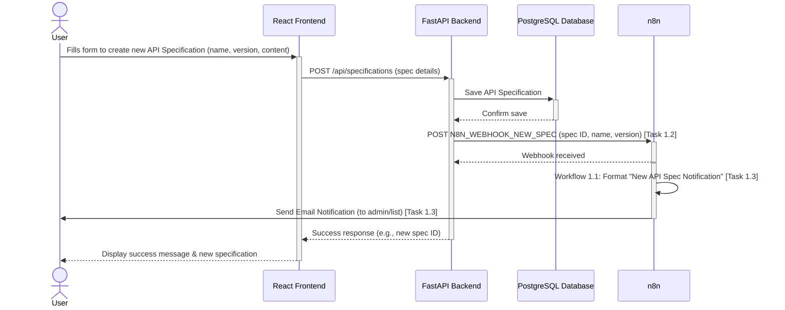
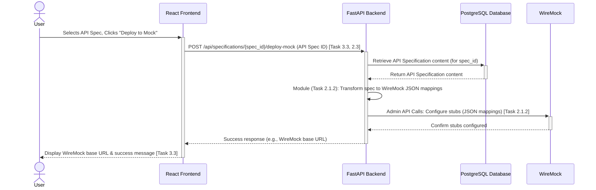
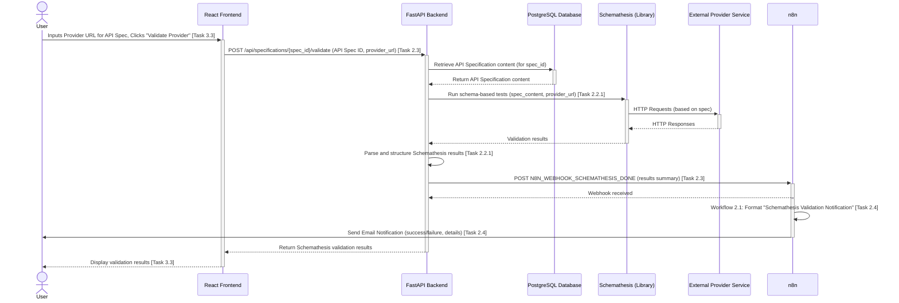
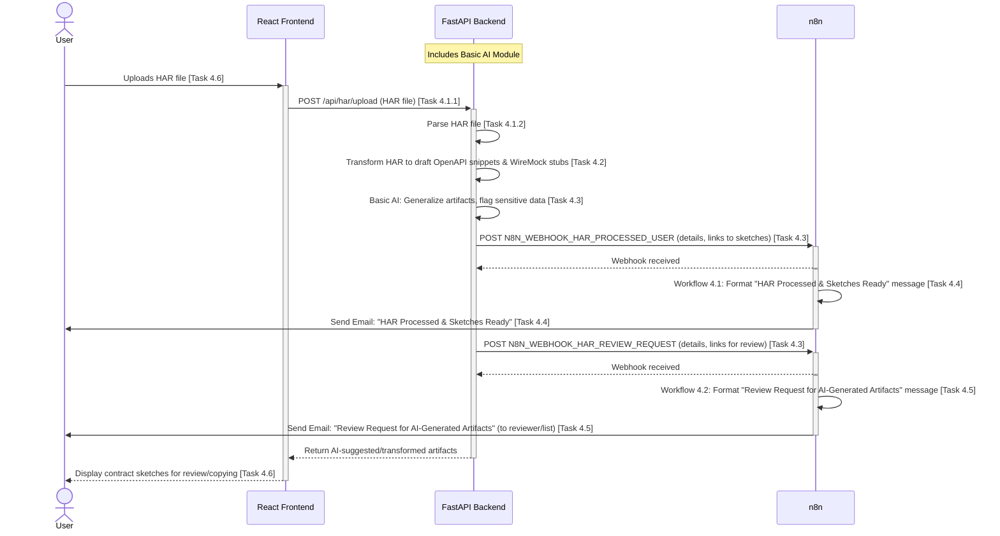
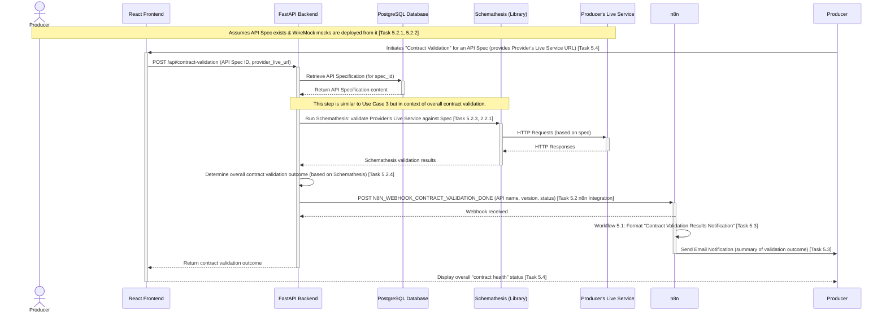

# MVP Use Case Sequence Diagrams

Here are the Mermaid sequence diagrams for the identified MVP use cases:

## 1. API Specification Management & New Spec Notification

This use case covers a user creating a new API specification, which is then saved by the backend, and a notification is triggered via n8n.

## 2. Mocking an API Specification

This use case shows a user triggering the deployment of an API specification to WireMock through the UI. No specific n8n notification is defined for *just* mock deployment completion in Phase 2 of the MVP.

## 3. Validating a Provider against an API Specification & Notification

This use case details a user initiating a Schemathesis validation for an API specification against a live provider URL. The backend performs the validation and triggers an n8n notification with the results.

## 4. HAR File Upload, "Contract Sketching," & Notifications

This use case covers a user uploading a HAR file. The backend processes it, uses basic AI for generalization, generates draft artifacts ("contract sketches"), and triggers n8n notifications for the user and for a review process.

## 5. End-to-End Mock-Centric Contract Validation & Notification

This use case outlines the producer validating their actual service against the API specification. The success of this validation (primarily based on Schemathesis results) implies that the producer's service aligns with the specification from which consumer-facing mocks are derived. The outcome is notified via n8n.

