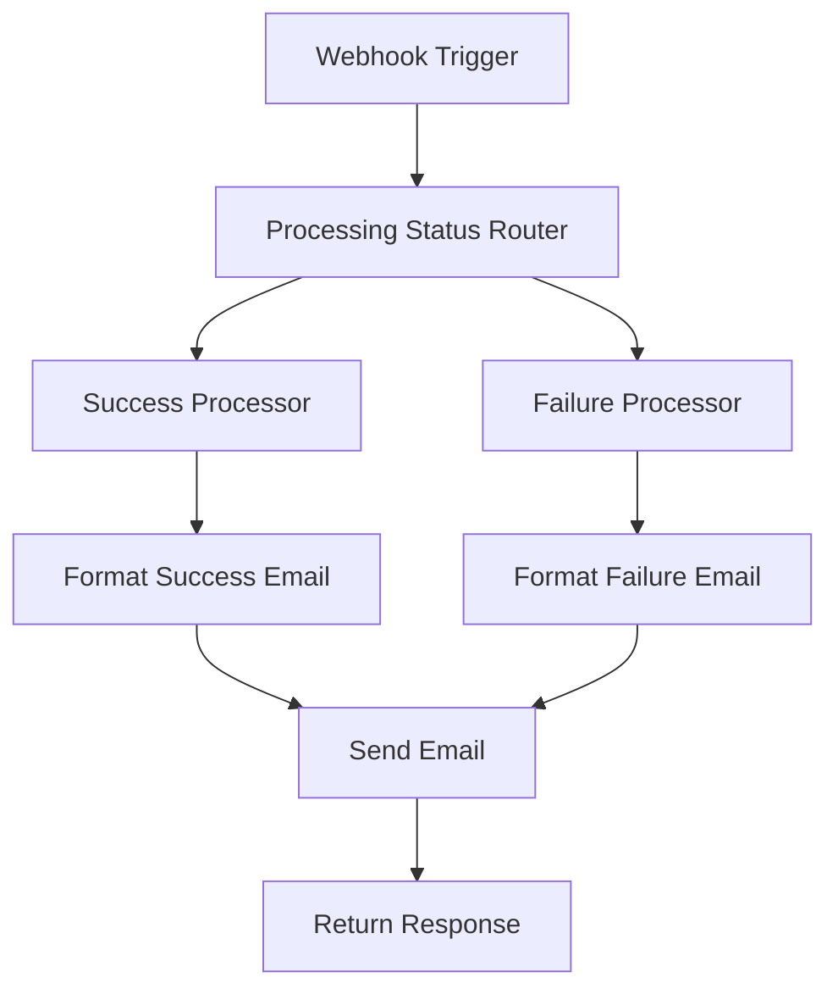

# HAR Processed Notification Workflow

## Overview

The **HAR Processed Notification Workflow** (`har-processed-notification.json`) sends detailed notifications when HAR file processing completes, whether successful or failed. This workflow provides enhanced functionality specifically for HAR processing events with detailed processing statistics and artifact information.

## Workflow Purpose

This workflow provides specialized HAR processing notifications that:

- Send detailed notifications for HAR processing completion (success/failure)
- Include comprehensive processing statistics and metrics
- Provide direct links to generated artifacts and platform UI
- Display processing progress and success rates
- Offer enhanced email templates with processing context

## Webhook Configuration

- **Webhook Path**: `/har-processed`
- **Full URL**: `http://localhost:5679/webhook/har-processed` (development)
- **Method**: POST
- **Content-Type**: application/json

## Workflow Structure

### Node Overview

1. **Webhook Trigger** - Receives HAR processing notifications
2. **Processing Status Router** - Routes based on success/failure
3. **Success Processor** - Formats successful processing data
4. **Failure Processor** - Formats failed processing data
5. **Email Formatter** - Creates rich email content with statistics
6. **Email Sender** - Sends formatted notifications
7. **Response Handler** - Returns success/error responses

### Workflow Flow



## Setup Instructions

### Step 1: Import Workflow

1. **Start n8n service:**

   ```bash
   docker-compose up n8n -d
   ```

2. **Access n8n interface:**
   - Open browser to `http://localhost:5679`
   - Login or create account if first time

3. **Import workflow:**
   - Click "Workflows" in the sidebar
   - Click "Import from File" button
   - Select `n8n/workflows/har-processed-notification.json`
   - Click "Import"
   - Save the workflow

### Step 2: Configure Email Credentials

1. **Create SMTP credential:**
   - Go to "Settings" → "Credentials"
   - Click "Add Credential"
   - Select "SMTP" from the list
   - Configure your email settings:

   ```
   Host: smtp.gmail.com (for Gmail)
   Port: 587
   Username: your-email@gmail.com
   Password: your-app-password
   Security: TLS
   ```

2. **Update email nodes:**
   - Open the workflow editor
   - Click on the "Send Email" node
   - Select your SMTP credential from the dropdown
   - Update recipient email addresses as needed

### Step 3: Configure Backend Integration

1. **Set environment variables:**

   ```bash
   # In your .env file or docker-compose.yml
   N8N_HAR_PROCESSED_WEBHOOK_URL=http://n8n:5678/webhook/har-processed
   N8N_WEBHOOK_SECRET=your-secret-key-here
   ```

2. **Docker Compose configuration:**

   ```yaml
   services:
     backend:
       environment:
         - N8N_HAR_PROCESSED_WEBHOOK_URL=http://n8n:5678/webhook/har-processed
         - N8N_WEBHOOK_SECRET=specrepo-n8n-secret-2024
   ```

### Step 4: Activate Workflow

1. **Enable the workflow:**
   - In the workflow editor, toggle the "Active" switch to ON
   - The webhook endpoint is now live and ready to receive notifications

2. **Verify activation:**
   - Check that the webhook trigger shows "Listening for events"
   - The status indicator should be green

## Payload Structure

### Successful Processing

```json
{
  "upload_id": 123,
  "file_name": "api-traffic-capture.har",
  "user_id": 456,
  "timestamp": "2024-01-15T14:30:00Z",
  "processing_status": "completed",
  "processing_statistics": {
    "interactions_count": 75,
    "processed_interactions_count": 72,
    "openapi_paths_count": 15,
    "wiremock_stubs_count": 72,
    "processing_steps_completed": 5,
    "total_processing_steps": 5,
    "processing_progress": 100,
    "processing_options": {
      "enable_ai_processing": true,
      "enable_data_generalization": true
    }
  },
  "artifacts_summary": {
    "openapi_available": true,
    "openapi_title": "Generated API from HAR Traffic",
    "openapi_version": "1.0.0",
    "openapi_paths_count": 15,
    "wiremock_available": true,
    "wiremock_stubs_count": 72,
    "artifacts_generated_at": "2024-01-15T14:30:00Z"
  }
}
```

### Failed Processing

```json
{
  "upload_id": 124,
  "file_name": "corrupted-traffic.har",
  "user_id": 456,
  "timestamp": "2024-01-15T14:45:00Z",
  "processing_status": "failed",
  "processing_statistics": {
    "interactions_count": 50,
    "processed_interactions_count": 0,
    "openapi_paths_count": 0,
    "wiremock_stubs_count": 0,
    "processing_steps_completed": 2,
    "total_processing_steps": 5,
    "processing_progress": 40,
    "processing_options": {
      "enable_ai_processing": true,
      "enable_data_generalization": true
    }
  },
  "error_message": "Invalid HAR file format: Missing required 'entries' field"
}
```

## Email Templates

### Success Email Template

**Subject:** `[SpecRepo] HAR Processing Complete: {{$json.file_name}}`

**Content includes:**

- Processing completion confirmation
- File processing statistics (interactions processed, success rate)
- Generated artifacts summary (OpenAPI specs, WireMock stubs)
- Direct links to view artifacts in the platform
- Processing options and AI configuration used
- Next steps for reviewing and using artifacts

### Failure Email Template

**Subject:** `[SpecRepo] HAR Processing Failed: {{$json.file_name}}`

**Content includes:**

- Processing failure notification
- Error message and failure reason
- Partial processing statistics (what was completed)
- Troubleshooting suggestions
- Contact information for support
- Instructions for re-uploading or fixing the HAR file

## Testing the Workflow

### Manual Testing

1. **Test successful processing:**

   ```bash
   curl -X POST http://localhost:5679/webhook/har-processed \
     -H "Content-Type: application/json" \
     -d '{
       "upload_id": 123,
       "file_name": "test-traffic.har",
       "user_id": 456,
       "timestamp": "2024-01-15T15:00:00Z",
       "processing_status": "completed",
       "processing_statistics": {
         "interactions_count": 25,
         "processed_interactions_count": 23,
         "openapi_paths_count": 8,
         "wiremock_stubs_count": 23,
         "processing_steps_completed": 5,
         "total_processing_steps": 5,
         "processing_progress": 100,
         "processing_options": {
           "enable_ai_processing": true,
           "enable_data_generalization": true
         }
       },
       "artifacts_summary": {
         "openapi_available": true,
         "openapi_title": "Test API",
         "openapi_version": "1.0.0",
         "openapi_paths_count": 8,
         "wiremock_available": true,
         "wiremock_stubs_count": 23,
         "artifacts_generated_at": "2024-01-15T15:00:00Z"
       }
     }'
   ```

2. **Test failed processing:**

   ```bash
   curl -X POST http://localhost:5679/webhook/har-processed \
     -H "Content-Type: application/json" \
     -d '{
       "upload_id": 124,
       "file_name": "invalid-file.har",
       "user_id": 456,
       "timestamp": "2024-01-15T15:05:00Z",
       "processing_status": "failed",
       "processing_statistics": {
         "interactions_count": 0,
         "processed_interactions_count": 0,
         "processing_steps_completed": 1,
         "total_processing_steps": 5,
         "processing_progress": 20
       },
       "error_message": "Invalid HAR file format"
     }'
   ```

### Integration Testing

1. **Upload HAR file via API:**

   ```bash
   curl -X POST http://localhost:8000/api/har/upload \
     -H "X-API-Key: your-api-key" \
     -F "file=@sample_har_file.har"
   ```

2. **Verify notification:**
   - Check n8n executions for the workflow
   - Verify email was sent with correct content
   - Check that processing statistics are displayed correctly

## Customization

### Email Content Customization

1. **Success email customization:**
   - Edit the "Format Success Email" node
   - Modify subject line and email body
   - Add or remove processing statistics
   - Customize artifact links and instructions

2. **Failure email customization:**
   - Edit the "Format Failure Email" node
   - Modify error message formatting
   - Add troubleshooting steps
   - Customize support contact information

### Recipient Configuration

1. **Static recipients:**
   - Edit the "Send Email" node
   - Update "To Email" field
   - Support multiple recipients: `admin@example.com,dev-team@example.com`

2. **Dynamic recipients:**
   - Use expressions to set recipients based on user data
   - Example: `{{$json.user_email}}` for user-specific notifications
   - Add conditional logic for different user types

### Processing Statistics Display

1. **Customize metrics:**
   - Edit email template to show/hide specific statistics
   - Add calculated fields (success rates, processing time)
   - Format numbers and percentages

2. **Add visual elements:**
   - Include progress bars using text/ASCII art
   - Add status icons or emojis
   - Format statistics in tables

## Advanced Features

### Conditional Logic

The workflow includes conditional logic for:

- Different email content based on processing success/failure
- Artifact availability checks
- Processing option display
- Error message formatting

### Data Transformation

The workflow transforms raw processing data into:

- Human-readable statistics
- Formatted timestamps
- Calculated success rates
- User-friendly artifact summaries

### Error Handling

The workflow includes error handling for:

- Invalid payload structures
- Missing required fields
- Email delivery failures
- Webhook response formatting

## Troubleshooting

### Common Issues

1. **Workflow not triggering:**
   - Check workflow is active (green toggle)
   - Verify webhook URL in backend HAR processing service
   - Check n8n logs: `docker-compose logs n8n`

2. **Emails not sending:**
   - Verify SMTP credentials are correct
   - Test SMTP settings with simple workflow
   - Check email node configuration

3. **Incorrect email content:**
   - Verify payload structure matches expected format
   - Check data transformation nodes
   - Test with known good payload

### Debugging

1. **Check execution logs:**
   - Go to "Executions" in n8n
   - Click on failed executions
   - Review error messages and data flow

2. **Test data transformation:**
   - Use "Execute Node" feature
   - Verify processing statistics calculations
   - Check email template rendering

3. **Validate payload:**
   - Use n8n's webhook test feature
   - Send test payloads manually
   - Verify all required fields are present

## Integration with Backend

### HAR Processing Service Integration

The backend HAR processing service should call this webhook when:

- HAR file processing completes successfully
- HAR file processing fails
- Processing reaches specific milestones

### Payload Requirements

Ensure the backend sends all required fields:

- `upload_id` - Unique identifier for the HAR upload
- `file_name` - Original HAR file name
- `user_id` - User who uploaded the file
- `processing_status` - "completed" or "failed"
- `processing_statistics` - Detailed processing metrics
- `artifacts_summary` - Summary of generated artifacts (for success)
- `error_message` - Error details (for failures)

### Error Handling

The backend should handle webhook failures gracefully:

- Implement retry logic for failed webhook calls
- Log webhook responses for debugging
- Provide fallback notification methods if webhook is unavailable
