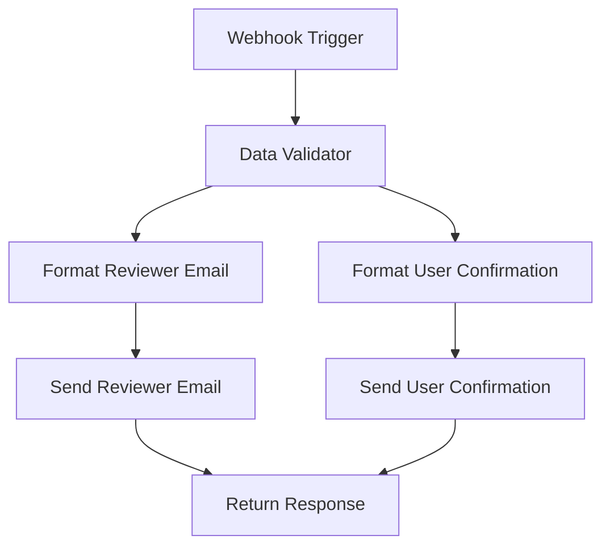

# HAR Review Request Workflow

## Overview

The **HAR Review Request Workflow** (`har-review-request.json`) sends review request notifications to reviewers when AI-generated HAR artifacts need approval. This workflow provides dual notifications and comprehensive review guidelines for quality assurance of AI-generated content.

## Workflow Purpose

This workflow provides specialized review request notifications that:

- Send review requests to designated reviewers for AI-generated artifacts
- Provide confirmation notifications to users who uploaded HAR files
- Include comprehensive review checklists and guidelines
- Offer direct links to review interface and artifact downloads
- Display processing context and AI configuration details
- Include review SLA and timeline information

## Webhook Configuration

- **Webhook Path**: `/har-review-request`
- **Full URL**: `http://localhost:5679/webhook/har-review-request` (development)
- **Method**: POST
- **Content-Type**: application/json

## Workflow Structure

### Node Overview

1. **Webhook Trigger** - Receives review request notifications
2. **Data Validator** - Validates payload structure and required fields
3. **Reviewer Email Formatter** - Creates detailed review request email
4. **User Confirmation Formatter** - Creates user confirmation email
5. **Dual Email Sender** - Sends both reviewer and user notifications
6. **Response Handler** - Returns success/error responses

### Workflow Flow



## Setup Instructions

### Step 1: Import Workflow

1. **Start n8n service:**

   ```bash
   docker-compose up n8n -d
   ```

2. **Access n8n interface:**
   - Open browser to `http://localhost:5679`
   - Login or create account if first time

3. **Import workflow:**
   - Click "Workflows" in the sidebar
   - Click "Import from File" button
   - Select `n8n/workflows/har-review-request.json`
   - Click "Import"
   - Save the workflow

### Step 2: Configure Email Credentials

1. **Create SMTP credential:**
   - Go to "Settings" → "Credentials"
   - Click "Add Credential"
   - Select "SMTP" from the list
   - Configure your email settings:

   ```
   Host: smtp.gmail.com (for Gmail)
   Port: 587
   Username: your-email@gmail.com
   Password: your-app-password
   Security: TLS
   ```

2. **Update email nodes:**
   - Open the workflow editor
   - Click on each "Send Email" node (reviewer and user)
   - Select your SMTP credential from the dropdown
   - Update recipient email addresses as needed

### Step 3: Configure Reviewer Settings

1. **Set reviewer email addresses:**
   - Edit the "Send Reviewer Email" node
   - Update "To Email" field with reviewer addresses
   - Example: `reviewer1@company.com,reviewer2@company.com`

2. **Configure review SLA:**
   - Edit email templates to include review timeline
   - Set expectations for review completion
   - Include escalation procedures if needed

### Step 4: Configure Backend Integration

1. **Set environment variables:**

   ```bash
   # In your .env file or docker-compose.yml
   N8N_HAR_REVIEW_WEBHOOK_URL=http://n8n:5678/webhook/har-review-request
   N8N_WEBHOOK_SECRET=your-secret-key-here
   ```

2. **Docker Compose configuration:**

   ```yaml
   services:
     backend:
       environment:
         - N8N_HAR_REVIEW_WEBHOOK_URL=http://n8n:5678/webhook/har-review-request
         - N8N_WEBHOOK_SECRET=specrepo-n8n-secret-2024
   ```

### Step 5: Activate Workflow

1. **Enable the workflow:**
   - In the workflow editor, toggle the "Active" switch to ON
   - The webhook endpoint is now live and ready to receive notifications

2. **Verify activation:**
   - Check that the webhook trigger shows "Listening for events"
   - The status indicator should be green

## Payload Structure

```json
{
  "upload_id": 123,
  "file_name": "api-traffic-capture.har",
  "user_id": 456,
  "user_email": "developer@company.com",
  "timestamp": "2024-01-15T16:00:00Z",
  "artifacts_summary": {
    "openapi_available": true,
    "openapi_title": "Generated API from HAR Traffic",
    "openapi_version": "1.0.0",
    "openapi_paths_count": 15,
    "wiremock_available": true,
    "wiremock_stubs_count": 72,
    "artifacts_generated_at": "2024-01-15T16:00:00Z"
  },
  "review_url": "http://localhost:5173/har-uploads/123/review",
  "processing_statistics": {
    "interactions_count": 75,
    "processed_interactions_count": 72,
    "processing_options": {
      "enable_ai_processing": true,
      "enable_data_generalization": true
    }
  }
}
```

## Email Templates

### Reviewer Email Template

**Subject:** `[SpecRepo] Review Request: AI-Generated Artifacts for {{$json.file_name}}`

**Content includes:**

- Review request notification and urgency
- HAR file and processing context
- Generated artifacts summary (OpenAPI specs, WireMock stubs)
- Direct link to review interface
- Comprehensive review checklist:
  - API specification accuracy and completeness
  - Data generalization effectiveness
  - Security and privacy compliance
  - Mock response appropriateness
  - Overall quality assessment
- Review timeline and SLA expectations
- Instructions for approval/rejection process
- Contact information for questions

### User Confirmation Email Template

**Subject:** `[SpecRepo] Review Requested: Your HAR Processing Results for {{$json.file_name}}`

**Content includes:**

- Confirmation that review has been requested
- Processing completion summary
- Generated artifacts overview
- Expected review timeline
- Next steps after review completion
- Instructions for accessing preliminary results
- Contact information for questions

## Review Checklist

The reviewer email includes a comprehensive checklist:

### 1. API Specification Review

- [ ] OpenAPI specification is valid and well-formed
- [ ] API paths and operations are accurately represented
- [ ] Request/response schemas are appropriate
- [ ] Parameter definitions are correct
- [ ] Authentication requirements are properly documented

### 2. Data Generalization Review

- [ ] Sensitive data has been properly generalized
- [ ] Personal information (PII) has been removed or anonymized
- [ ] API keys and tokens have been sanitized
- [ ] Business-specific data has been appropriately abstracted
- [ ] Data patterns remain realistic and useful

### 3. Mock Response Review

- [ ] WireMock stubs accurately represent real API behavior
- [ ] Response data is realistic and appropriate
- [ ] HTTP status codes are correct
- [ ] Response headers are properly configured
- [ ] Edge cases and error scenarios are covered

### 4. Security and Privacy Review

- [ ] No sensitive information is exposed in artifacts
- [ ] Authentication patterns are properly abstracted
- [ ] Security headers are appropriately configured
- [ ] Privacy requirements are met
- [ ] Compliance standards are maintained

### 5. Quality Assessment

- [ ] Generated artifacts are production-ready
- [ ] Documentation is clear and comprehensive
- [ ] Examples are helpful and accurate
- [ ] Overall quality meets standards
- [ ] Artifacts provide value for development/testing

## Testing the Workflow

### Manual Testing

```bash
curl -X POST http://localhost:5679/webhook/har-review-request \
  -H "Content-Type: application/json" \
  -d '{
    "upload_id": 123,
    "file_name": "test-api-traffic.har",
    "user_id": 456,
    "user_email": "developer@company.com",
    "timestamp": "2024-01-15T16:30:00Z",
    "artifacts_summary": {
      "openapi_available": true,
      "openapi_title": "Test API",
      "openapi_version": "1.0.0",
      "openapi_paths_count": 8,
      "wiremock_available": true,
      "wiremock_stubs_count": 25,
      "artifacts_generated_at": "2024-01-15T16:30:00Z"
    },
    "review_url": "http://localhost:5173/har-uploads/123/review",
    "processing_statistics": {
      "interactions_count": 30,
      "processed_interactions_count": 28,
      "processing_options": {
        "enable_ai_processing": true,
        "enable_data_generalization": true
      }
    }
  }'
```

### Integration Testing

1. **Upload HAR file with AI processing:**

   ```bash
   curl -X POST http://localhost:8000/api/har/upload \
     -H "X-API-Key: your-api-key" \
     -F "file=@sample_har_file.har" \
     -F "enable_ai_processing=true"
   ```

2. **Verify dual notifications:**
   - Check that reviewer email was sent with review checklist
   - Verify user confirmation email was sent
   - Confirm both emails contain correct information

## Customization

### Reviewer Configuration

1. **Multiple reviewer groups:**
   - Configure different reviewer lists for different types of content
   - Use conditional logic based on processing options
   - Implement round-robin or load balancing for reviewers

2. **Review assignment:**
   - Add logic to assign specific reviewers based on expertise
   - Include reviewer workload balancing
   - Implement escalation for overdue reviews

### Email Content Customization

1. **Review checklist customization:**
   - Add or remove checklist items based on requirements
   - Include company-specific review criteria
   - Add links to internal documentation and guidelines

2. **Timeline customization:**
   - Adjust review SLA based on artifact complexity
   - Include business hours and holiday considerations
   - Add automatic reminder functionality

### User Experience Enhancement

1. **Progress tracking:**
   - Include review status tracking links
   - Add estimated completion times
   - Provide real-time review progress updates

2. **Feedback integration:**
   - Include links to provide feedback on AI processing
   - Add rating systems for generated artifacts
   - Collect improvement suggestions

## Advanced Features

### Conditional Routing

The workflow can be enhanced with conditional routing based on:

- Artifact complexity (number of paths, interactions)
- Processing options used (AI level, generalization settings)
- User permissions and roles
- Content sensitivity levels

### Integration with Review System

The workflow can integrate with external review systems:

- Create tickets in project management tools
- Update review status in external databases
- Trigger additional workflows based on review outcomes
- Generate review metrics and reports

### Automated Quality Checks

Before sending for human review, the workflow can include:

- Automated quality validation
- Security scanning of generated artifacts
- Compliance checking
- Basic accuracy verification

## Troubleshooting

### Common Issues

1. **Dual emails not sending:**
   - Check both email nodes are configured correctly
   - Verify SMTP credentials for both nodes
   - Test each email node individually

2. **Review links not working:**
   - Verify review URL format in payload
   - Check frontend review interface is accessible
   - Confirm upload_id is valid and exists

3. **Missing reviewer notifications:**
   - Check reviewer email addresses are correct
   - Verify email delivery to reviewer inboxes
   - Check spam/junk folders

### Debugging

1. **Check execution flow:**
   - Verify both email branches execute
   - Check data transformation for each email type
   - Validate payload structure and required fields

2. **Test email delivery:**
   - Use n8n's email testing features
   - Send test emails to verify SMTP configuration
   - Check email logs for delivery confirmation

3. **Validate review process:**
   - Test complete review workflow end-to-end
   - Verify review interface functionality
   - Check artifact accessibility from review links

## Integration with Backend

### Review Request Triggers

The backend should trigger this workflow when:

- AI processing completes and generates artifacts
- Quality thresholds require human review
- User explicitly requests review
- Automated quality checks flag potential issues

### Payload Requirements

Ensure the backend sends all required fields:

- `upload_id` - Unique identifier for the HAR upload
- `file_name` - Original HAR file name
- `user_id` and `user_email` - User information
- `artifacts_summary` - Summary of generated artifacts
- `review_url` - Direct link to review interface
- `processing_statistics` - Context for review

### Review Outcome Handling

The backend should handle review outcomes:

- Process approval/rejection decisions
- Update artifact status based on review results
- Notify users of review completion
- Archive or publish approved artifacts
- Handle revision requests from reviewers
