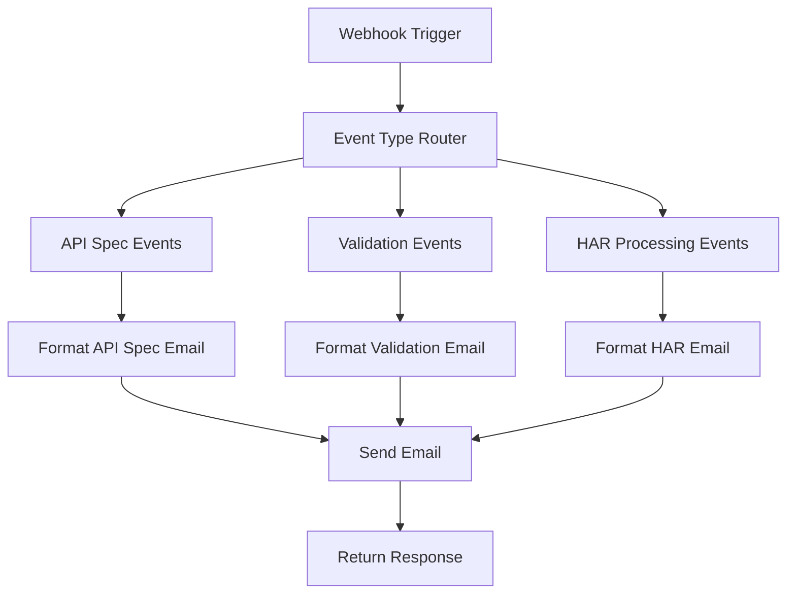

# Unified Notification Workflow

## Overview

The **Unified Notification Workflow** (`unified-notification.json`) is the central notification system for the SpecRepo platform. It handles all types of notifications through a single webhook endpoint with intelligent routing based on the `event_type` field.

## Workflow Purpose

This workflow provides a centralized notification system that:

- Receives webhook notifications from the SpecRepo backend
- Routes notifications based on event type
- Sends appropriate email notifications to configured recipients
- Provides consistent notification formatting across all event types
- Reduces complexity by consolidating multiple notification types

## Webhook Configuration

- **Webhook Path**: `/notification`
- **Full URL**: `http://localhost:5679/webhook/notification` (development)
- **Method**: POST
- **Content-Type**: application/json

## Supported Event Types

### 1. API Specification Events

- `created` - New API specification created
- `updated` - Existing API specification updated

### 2. Validation Events

- `validation_completed` - Validation run completed successfully
- `validation_failed` - Validation run failed or was cancelled

### 3. HAR Processing Events

- `har_processing_completed` - HAR file processing completed successfully
- `har_processing_failed` - HAR file processing failed
- `har_review_requested` - Review requested for AI-generated HAR artifacts

## Workflow Structure

### Node Overview

1. **Webhook Trigger** - Receives incoming notifications
2. **Event Type Router** - Routes based on `event_type` field
3. **Event-Specific Processors** - Format data for each event type
4. **Email Sender Nodes** - Send formatted notifications
5. **Response Handler** - Returns success/error responses

### Workflow Flow



## Setup Instructions

### Step 1: Import Workflow

1. **Start n8n service:**

   ```bash
   docker-compose up n8n -d
   ```

2. **Access n8n interface:**
   - Open browser to `http://localhost:5679`
   - Login or create account if first time

3. **Import workflow:**
   - Click "Workflows" in the sidebar
   - Click "Import from File" button
   - Select `n8n/workflows/unified-notification.json`
   - Click "Import"
   - Save the workflow

### Step 2: Configure Email Credentials

1. **Create SMTP credential:**
   - Go to "Settings" → "Credentials"
   - Click "Add Credential"
   - Select "SMTP" from the list
   - Configure your email settings:

   ```text
   Host: smtp.gmail.com (for Gmail)
   Port: 587
   Username: your-email@gmail.com
   Password: your-app-password
   Security: TLS
   ```

2. **Update email nodes:**
   - Open the workflow editor
   - Click on each "Send Email" node
   - Select your SMTP credential from the dropdown
   - Update recipient email addresses as needed

### Step 3: Configure Backend Integration

1. **Set environment variables:**

   ```bash
   # In your .env file or docker-compose.yml
   N8N_WEBHOOK_URL=http://n8n:5678/webhook/notification
   N8N_WEBHOOK_SECRET=your-secret-key-here
   N8N_MAX_RETRIES=3
   N8N_RETRY_DELAY_SECONDS=5
   N8N_TIMEOUT_SECONDS=30
   ```

2. **Docker Compose configuration:**

   ```yaml
   services:
     backend:
       environment:
         - N8N_WEBHOOK_URL=http://n8n:5678/webhook/notification
         - N8N_WEBHOOK_SECRET=specrepo-n8n-secret-2024
   ```

### Step 4: Activate Workflow

1. **Enable the workflow:**
   - In the workflow editor, toggle the "Active" switch to ON
   - The webhook endpoint is now live and ready to receive notifications

2. **Verify activation:**
   - Check that the webhook trigger shows "Listening for events"
   - The status indicator should be green

## Payload Examples

### API Specification Created/Updated

```json
{
  "event_type": "created",
  "specification_id": 123,
  "specification_name": "User Management API",
  "version_string": "v1.2.0",
  "user_id": 456,
  "timestamp": "2024-01-15T10:30:00Z",
  "openapi_content": {
    "openapi": "3.0.0",
    "info": {
      "title": "User Management API",
      "description": "API for managing user accounts",
      "version": "1.2.0"
    },
    "paths": {
      "/users": {
        "get": {
          "summary": "List users",
          "responses": {
            "200": {
              "description": "Success"
            }
          }
        }
      }
    }
  }
}
```

### Validation Completed/Failed

```json
{
  "event_type": "validation_completed",
  "validation_run_id": 789,
  "specification_id": 123,
  "specification_name": "User Management API",
  "provider_url": "https://api.example.com",
  "user_id": 456,
  "status": "completed",
  "timestamp": "2024-01-15T10:45:00Z",
  "validation_results": {
    "total_tests": 15,
    "passed_tests": 13,
    "failed_tests": 2
  },
  "validation_statistics": {
    "success_rate": 86.7,
    "execution_time": 45.2,
    "error_count": 0,
    "total_tests": 15,
    "passed_tests": 13,
    "failed_tests": 2
  }
}
```

### HAR Processing Completed/Failed

```json
{
  "event_type": "har_processing_completed",
  "upload_id": 456,
  "file_name": "api-traffic.har",
  "user_id": 789,
  "timestamp": "2024-01-15T11:00:00Z",
  "processing_status": "completed",
  "processing_statistics": {
    "interactions_count": 50,
    "processed_interactions_count": 48,
    "openapi_paths_count": 12,
    "wiremock_stubs_count": 48,
    "processing_steps_completed": 5,
    "total_processing_steps": 5,
    "processing_progress": 100,
    "processing_options": {
      "enable_ai_processing": true,
      "enable_data_generalization": true
    }
  },
  "artifacts_summary": {
    "openapi_available": true,
    "openapi_title": "Generated API from HAR",
    "openapi_version": "1.0.0",
    "openapi_paths_count": 12,
    "wiremock_available": true,
    "wiremock_stubs_count": 48,
    "artifacts_generated_at": "2024-01-15T11:00:00Z"
  }
}
```

## Testing the Workflow

### Manual Testing

1. **Test with curl:**

   ```bash
   curl -X POST http://localhost:5679/webhook/notification \
     -H "Content-Type: application/json" \
     -d '{
       "event_type": "created",
       "specification_id": 123,
       "specification_name": "Test API",
       "version_string": "v1.0",
       "user_id": 456,
       "timestamp": "2024-01-15T12:00:00Z",
       "openapi_content": {
         "openapi": "3.0.0",
         "info": {"title": "Test API"},
         "paths": {}
       }
     }'
   ```

2. **Check execution:**
   - Go to "Executions" in n8n
   - Verify the workflow executed successfully
   - Check email delivery

### Integration Testing

1. **Create API specification:**

   ```bash
   curl -X POST http://localhost:8000/api/specifications \
     -H "Content-Type: application/json" \
     -H "X-API-Key: your-api-key" \
     -d '{
       "name": "Test API",
       "version_string": "v1.0",
       "openapi_content": {
         "openapi": "3.0.0",
         "info": {"title": "Test API"},
         "paths": {}
       }
     }'
   ```

2. **Verify notification:**
   - Check n8n executions
   - Verify email was sent
   - Check email content formatting

## Customization

### Email Templates

Each event type has its own email template that can be customized:

1. **API Specification Events:**
   - Subject: `[SpecRepo] API Specification {{$json.event_type}}: {{$json.specification_name}}`
   - Template includes specification details and OpenAPI summary

2. **Validation Events:**
   - Subject: `[SpecRepo] Validation {{$json.status}}: {{$json.specification_name}}`
   - Template includes test results and success rates

3. **HAR Processing Events:**
   - Subject: `[SpecRepo] HAR Processing {{$json.processing_status}}: {{$json.file_name}}`
   - Template includes processing statistics and artifact summary

### Adding New Event Types

To add support for new event types:

1. **Update the router node:**
   - Add new condition for your event type
   - Route to appropriate processing branch

2. **Create processing node:**
   - Add node to format data for your event type
   - Configure email template

3. **Update documentation:**
   - Add payload example
   - Document new event type

### Recipient Configuration

To change email recipients:

1. **Edit email nodes:**
   - Click on "Send Email" nodes
   - Update "To Email" field
   - Support multiple recipients: `admin@example.com,team@example.com`

2. **Dynamic recipients:**
   - Use expressions to set recipients based on event data
   - Example: `{{$json.user_email}}` for user-specific notifications

## Troubleshooting

### Common Issues

1. **Workflow not triggering:**
   - Check workflow is active (green toggle)
   - Verify webhook URL in backend configuration
   - Check n8n logs: `docker-compose logs n8n`

2. **Emails not sending:**
   - Verify SMTP credentials are correct
   - Test SMTP settings with simple workflow
   - Check email node configuration

3. **Wrong email content:**
   - Verify event type routing
   - Check email template expressions
   - Test with known payload structure

### Debugging

1. **Check execution logs:**
   - Go to "Executions" in n8n
   - Click on failed executions
   - Review error messages and data flow

2. **Test individual nodes:**
   - Use "Execute Node" feature
   - Verify data transformation at each step
   - Check expression outputs

3. **Webhook testing:**
   - Use n8n's webhook test feature
   - Send test payloads manually
   - Verify payload structure matches expected format

## Security Considerations

1. **Webhook security:**
   - Use webhook secrets for authentication
   - Validate payload structure
   - Implement rate limiting if needed

2. **Email security:**
   - Use app passwords for Gmail
   - Store credentials securely in n8n
   - Avoid including sensitive data in emails

3. **Network security:**
   - Use internal Docker network for service communication
   - Restrict external access to n8n interface
   - Use HTTPS in production environments

## Performance Optimization

1. **Workflow efficiency:**
   - Minimize node execution time
   - Use efficient data transformations
   - Avoid unnecessary API calls

2. **Email delivery:**
   - Configure appropriate retry settings
   - Use bulk email services for high volume
   - Implement email queuing if needed

3. **Monitoring:**
   - Set up execution monitoring
   - Track success/failure rates
   - Monitor email delivery rates
